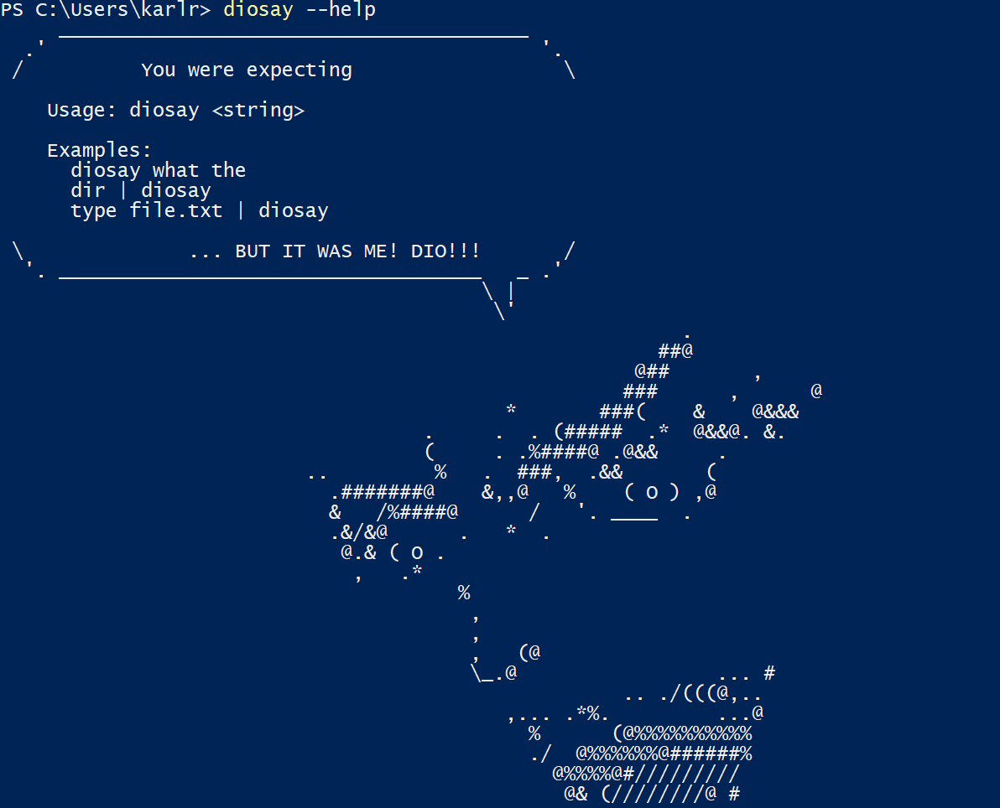

# diosay

> You were expecting a description.

Feel on top of the world right now? Come back down and let [Dio Brando](https://en.wikipedia.org/wiki/Dio_Brando) inflame you with indignation as he invades your shell environment and violates your console output.

est uan sin



## Build Instructions

```shell
g++ main.cpp -o diosay -std=gnu++0x
```
